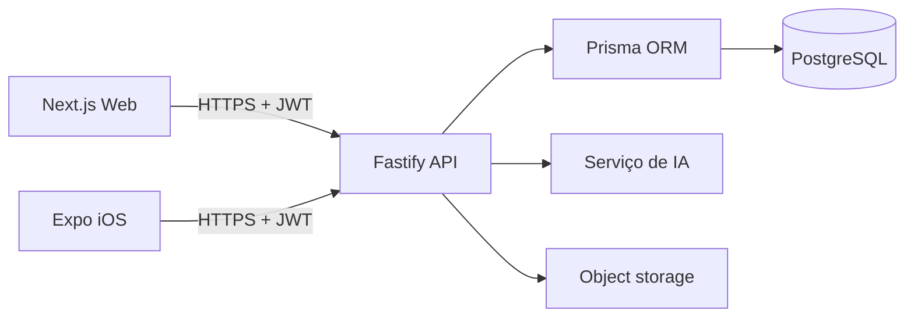

# Arquitetura

O domínio financeiro é centralizado na API. O cliente nunca conversa diretamente com o banco nem envia o banco inteiro à IA. O serviço de IA deverá receber apenas agregados consultados pela API e aplicar controle de acesso do usuário autenticado.

## Entidades

`User` cria `Transaction`, `Product`, `Category` e `FutureExpense`. Cada alteração gera `AuditLog`. Transações pertencem a uma categoria e podem apontar opcionalmente para um produto.
